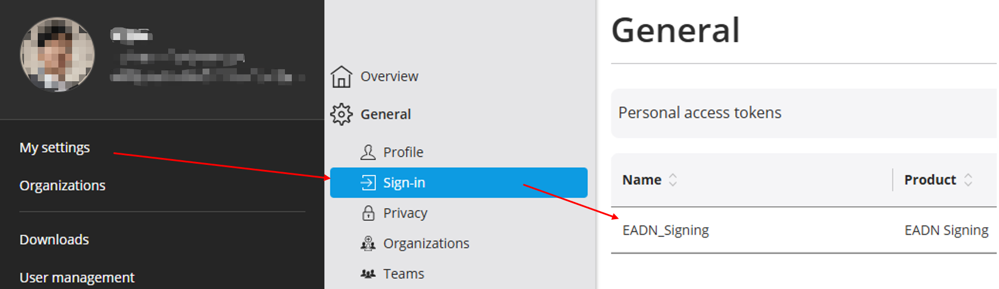

# eplan-addin-template

<p align="center">
    <a href="https://github.com/bingyongcao/eplan-addin-template/blob/main/README-cn.md">中文</a>
    |
    <a href="https://github.com/bingyongcao/eplan-addin-template/blob/main/README.md">English</a>
</p>

这是一个面向 Visual Studio 的 EPLAN Add-in 项目模板仓库，包含：

`EPLAN_ADDIN_TEMPLATE`：导出为 Visual Studio 项目模板，

`EPLAN_ADDIN_TEMPLATE.Wizard`：用于 Add-in 模板的自定义向导，在模板创建期间运行。

## 自定义向导

向导在创建模板时会自动应用以下默认值：

- `AssemblyName` = `Company.EplAddIn.<ProjectName>`
- 调试启动操作 = `EPLAN.exe`（路径由 `detect-eplan.ps1` 自动检测）
- 调试启动参数 = `/Variant:"Electric P8"`

## 如何安装模板

1. Project -> Export template -> 选择解决方案目录中的图标
2. 构建 `EPLAN_ADDIN_TEMPLATE.Wizard`
3. 解压模板，然后编辑 `.vstemplate` 文件，在 `VSTemplate` 标签内添加向导扩展：

```xml
<WizardExtension>
  <Assembly>EPLAN_ADDIN_TEMPLATE.Wizard, Version=1.0.0.0, Culture=neutral, PublicKeyToken=null</Assembly>
  <FullClassName>EPLAN_ADDIN_TEMPLATE.Wizard.TemplateWizard</FullClassName>
</WizardExtension>
```

4. 重新打包模板，注意 zip 的目录层级
5. 将 `EPLAN_ADDIN_TEMPLATE.Wizard.dll` 和 `detect-eplan.ps1` 拷贝到 Visual Studio 能够加载模板向导程序集的位置，例如：

```
C:\Program Files\Microsoft Visual Studio\18\Community\Common7\IDE\PublicAssemblies
```

6. 将模板 zip 复制到模板目录：

```
C:\Users\<user>\Documents\Visual Studio 18\Templates\ProjectTemplates
```

## 模板存放位置

```
C:\Users\<user>\Documents\Visual Studio 18\My Exported Templates
C:\Users\<user>\Documents\Visual Studio 18\Templates\ProjectTemplates
```

## 从模板创建项目后

1. 还原包：

```
dotnet restore
```

2. dll 签名（[EADN 签名指南](../Resources/EADN-Signing-Script-V1.8/EADN_signing_guide-Eplan_Cloud.pdf)）

    1. 为 Debug / Release 模式分别创建条件编译（仅在 Release 模式下签名）
    2. 将公钥绑定到程序集，并启用 "Delay sign only"
    3. 在后期生成事件中加入签名命令行（使用官方提供的 [PostBuildScript.ps1](../Resources/EADN-Signing-Script-V1.8/PostBuildScript.ps1)）：

    ```
    powershell -ExecutionPolicy Bypass -file "<YourFolderName>\PostBuildScript.ps1" -baseUrl "https://api.eplan.com.cn/eadn-signing/v1.0" -comment "signing dll from $(USERNAME)" -accessToken "<YourPAT>" -assemblies "$(OutDir)$(AssemblyName).dll" -destinationPath "$(OutDir)." -deleteAfterwards
    ```

    > PAT 获取方式
    

## 离线 API 帮助

### 安装包

- [2026 离线 API 安装包](Resources/Eplan_API_2026.zip)

- 请参考官方安装指南：[EPLAN API 2026 Help Structure](https://www.eplan.help/en-us/Infoportal/Content/api/2026/Help%20structure.html)

- 安装完成后，还可以在 Visual Studio 中将 `F1` 绑定到 `EPLAN API Help`，这样编码时按下 `F1` 就能直接打开 API 帮助。

## 模板工作流

1. 将 `EPLAN_ADDIN_TEMPLATE` 导出为 Visual Studio 项目模板。
2. 构建 `EPLAN_ADDIN_TEMPLATE.Wizard`。
3. 在导出的 `.vstemplate` 文件中添加向导扩展配置。
4. 将生成的模板 zip 复制到 Visual Studio 2026 的模板目录。
5. 将 `EPLAN_ADDIN_TEMPLATE.Wizard.dll` 复制到 Visual Studio 的 `PublicAssemblies` 目录。

在复制步骤中，可以先根据本机环境调整硬编码路径，然后使用 `install-template.ps1` 来完成。

## SVG 图标

> 可以从 [lucide](https://lucide.dev/icons/) 查找 svg 图标资源。不要忘记修改描边颜色。

EPLAN 配色表：

<div style="display: flex; flex-wrap: wrap; gap: 20px; padding: 16px; border-radius: 12px;">

  <div style="text-align: center;">
    <div style="width: 80px; height: 80px; background-color: #E9EAEA; border-radius: 8px; box-shadow: 0 2px 4px rgba(0,0,0,0.1);"></div>
    <code style="margin-top: 8px; display: block;">#E9EAEA</code>
  </div>

  <div style="text-align: center;">
    <div style="width: 80px; height: 80px; background-color: #464646; border-radius: 8px; box-shadow: 0 2px 4px rgba(0,0,0,0.1);"></div>
    <code style="margin-top: 8px; display: block;">#464646</code>
  </div>

  <div style="text-align: center;">
    <div style="width: 80px; height: 80px; background-color: #0D9BE2; border-radius: 8px; box-shadow: 0 2px 4px rgba(0,0,0,0.1);"></div>
    <code style="margin-top: 8px; display: block;">#0D9BE2</code>
  </div>

  <div style="text-align: center;">
    <div style="width: 80px; height: 80px; background-color: #E2001A; border-radius: 8px; box-shadow: 0 2px 4px rgba(0,0,0,0.1);"></div>
    <code style="margin-top: 8px; display: block;">#E2001A</code>
  </div>

  <div style="text-align: center;">
    <div style="width: 80px; height: 80px; background-color: #F7CC1B; border-radius: 8px; box-shadow: 0 2px 4px rgba(0,0,0,0.1);"></div>
    <code style="margin-top: 8px; display: block;">#F7CC1B</code>
  </div>

  <div style="text-align: center;">
    <div style="width: 80px; height: 80px; background-color: #F7821B; border-radius: 8px; box-shadow: 0 2px 4px rgba(0,0,0,0.1);"></div>
    <code style="margin-top: 8px; display: block;">#F7821B</code>
  </div>

  <div style="text-align: center;">
    <div style="width: 80px; height: 80px; background-color: #62BA46; border-radius: 8px; box-shadow: 0 2px 4px rgba(0,0,0,0.1);"></div>
    <code style="margin-top: 8px; display: block;">#62BA46</code>
  </div>

</div>